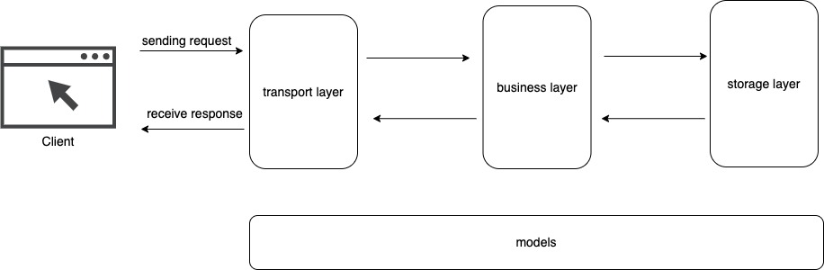

# RESTAPI

## Getting started
- Setup environment: `make env`
- Run migrations: `make migrate`
- Run the service: `make run`
- Check other commands in the `Makefile` file

## Project structure

|`middleware`: application middlewares
|`migration`: database migrations
|`pkg`: helper packages (like 3rd-party packages in vendor/)
|`module`
|--`product`
   |--`producttransport`: receive and respond client requests 
   |--`productbusiness`: do the business logic
   |--`productstore`: handle database logic
   |--`productmodel`: contains all models in the module
|--`user`
    |--`producttransport`
    |--`productbusiness`
    |--`productstore`
    |--`productmodel`

